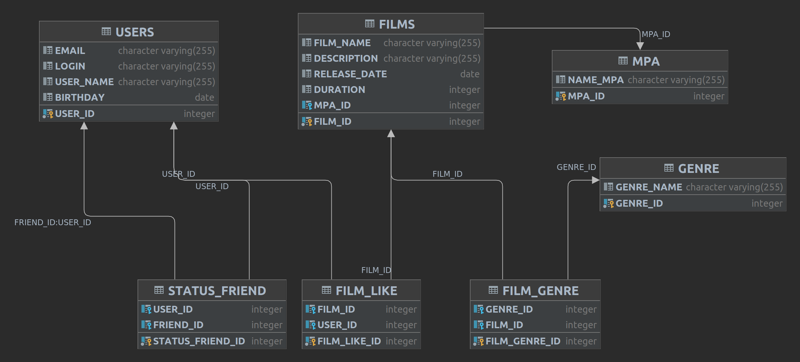

# java-filmorate
Template repository for Filmorate project.

Таблица FILMS содержит информацию о фильмах, такую как название, описание, дата выхода, продолжительность и идентификатор MPA (рейтинг).
Таблица GENRE содержит информацию о жанрах фильмов.
Таблица FILM_GENRE содержит связь между фильмами и жанрами, используя идентификаторы фильма и жанра.
Таблица MPA содержит информацию о возрастных рейтингах фильмов.
Таблица USERS содержит информацию о пользователях, включая электронную почту, логин, имя пользователя и дату рождения.
Таблица STATUS_FRIEND содержит информацию о статусе дружбы пользователей.
Таблица FILM_LIKE содержит информацию о том, какие фильмы пользователь лайкнул.

Можно выделить следующие связи:
- Связь "один ко многим" между таблицами FILMS и MPA, где поле FILMS.MPA_ID является внешним ключом, ссылающимся на MPA.MPA_ID.
- Связь "многие ко многим" между таблицами FILMS и GENRE, где связь реализована через промежуточную таблицу FILM_GENRE. Поля FILM_GENRE.GENRE_ID и FILM_GENRE.FILM_ID являются внешними ключами, ссылающимися на GENRE.GENRE_ID и FILMS.FILM_ID соответственно.
- Связь "один ко многим" между таблицами USERS и STATUS_FRIEND, где поля STATUS_FRIEND.USER_ID и STATUS_FRIEND.FRIEND_ID являются внешними ключами, ссылающимися на USERS.USER_ID.
- Связь "один ко многим" между таблицами FILMS и FILM_LIKE, где поле FILM_LIKE.FILM_ID является внешним ключом, ссылающимся на FILMS.FILM_ID.

Примеры запросов:
1. Вставка данных в таблицу FILMS:
   INSERT INTO FILMS (FILM_NAME, DESCRIPTION, RELEASE_DATE, DURATION, MPA_ID)
   VALUES ('Film 1', 'Description 1', '2021-01-01', 120, 1);

2. Получение данных из таблицы FILMS:
   SELECT * FROM FILMS;

3. Обновление данных в таблице FILMS:
   UPDATE FILMS
   SET FILM_NAME = 'New Film Name'
   WHERE FILM_ID = 1;

4. Удаление данных из таблицы FILMS:
   DELETE FROM FILMS
   WHERE FILM_ID = 1;

5. Добавление связи фильма с жанром в таблице FILM_GENRE:
   INSERT INTO FILM_GENRE (GENRE_ID, FILM_ID)
   VALUES (1, 1);